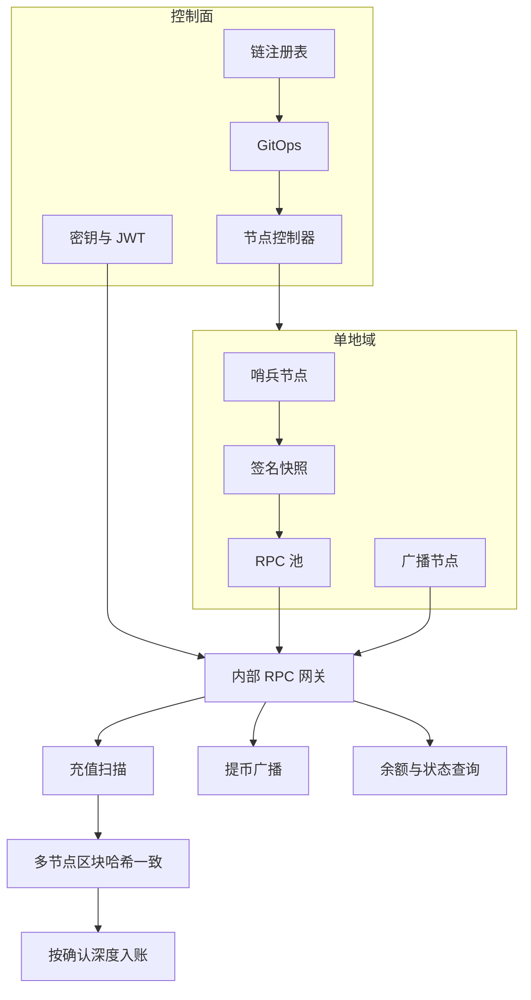
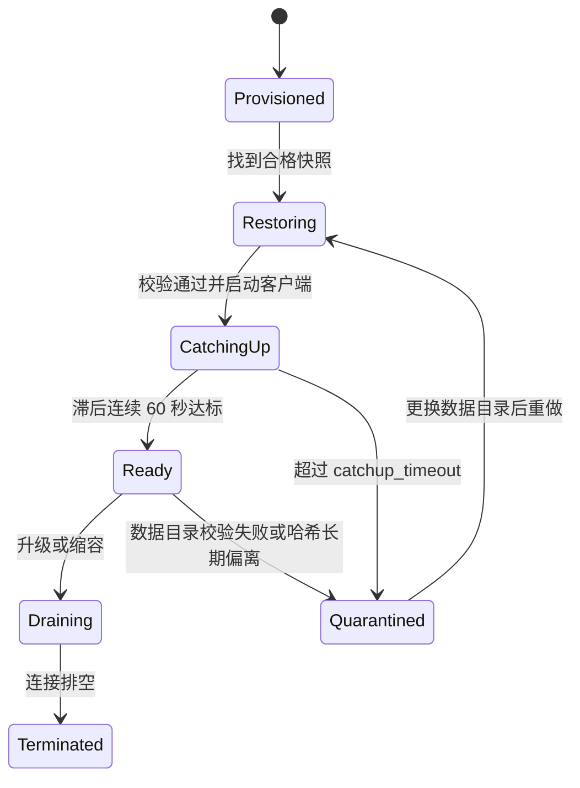
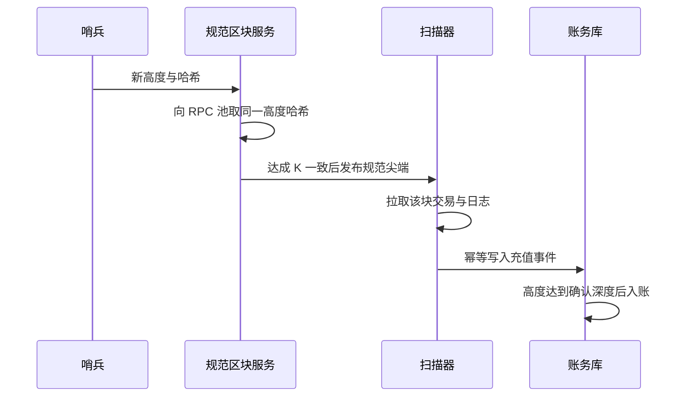

# 交易所多链全节点运维方案

本文给出交易所场景下百余条链全节点的运维规格。目标是三条：链尖数据持续新鲜、内部 RPC 可发现且与线上策略一致、节点平面具备与热钱包隔离的安全边界。

注册表是节点配置、网关策略和 RPC 文档的唯一来源。文中的阈值是设计初值，T0 链上线前用 14 天烧机数据回写注册表。

## 1. 目标与分级

充值扫描和提币广播跟随链尖。查询只打到已经追上尖端的节点。全节点主机不保存提币私钥。签名在独立的托管 / HSM 网络完成，节点只广播已经签好的交易。

按资金量和出块速度分三级。

| 级别 | 典型链 | 每地域 RPC 副本 | 滞后门槛（超过即摘流） | 最低部署 |
| --- | --- | --- | --- | --- |
| T0 | BTC、ETH、SOL、BSC、TRON | 3 | BTC ≤ 1 块或 15 分钟；ETH ≤ 2 块或 30 秒；SOL ≤ 32 slot；BSC 按实测出块时间折算 ≤ 20 秒 | 两地域，每地域哨兵 + RPC + 广播节点 |
| T1 | 主流 L2、LTC、DOGE 等 | 2 | 落后尖端 ≤ 30 秒 | 两副本，跨可用区 |
| T2 | 长尾链 | 2 | 落后尖端 ≤ 2 分钟 | 一主一备，快照可在数小时内重建 |

业务新鲜度拆成三段预算，分别度量、分别告警：

| 段 | 含义 | T0 初值 | 归属 |
| --- | --- | --- | --- |
| 导入滞后 | 本机已导入高度相对哨兵尖端 | 见上表 | 节点 |
| 投递滞后 | 扫描器收到规范尖端相对本机导入 | ≤ 2 秒 | 订阅与索引 |
| 确认等待 | 达到该链 `confirmation_depth` | 按链风险策略，写入注册表 | 账务 |

确认等待是风险政策。节点侧把前两段压到门槛内，账务侧只消费已经确认的规范高度。

## 2. 总体架构

控制面保持一份链注册表，GitOps 渲染各链配置。数据面按地域部署：哨兵负责同步和产快照，RPC 池对内只读服务，广播节点专门发交易。业务系统只访问统一网关。



一百多条链里绝大多数是 EVM。按客户端家族做模板，一条链是注册表里的一条记录。

| 家族 | 客户端 | 覆盖范围 | 加速手段 |
| --- | --- | --- | --- |
| EVM | Reth，T0 再配第二客户端 | ETH、BSC、各 L2 和侧链 | snap / checkpoint 同步，内部快照补齐 |
| Bitcoin 系 | Bitcoin Core 及其分叉 | BTC、LTC、DOGE | AssumeUTXO 或内部快照，ZMQ 推送 |
| Solana | Agave RPC | SOL | 自有或官方快照，RPC 与投票身份分开 |
| Cosmos | 各链二进制 | ATOM 及同 SDK 链 | state sync，再追块 |
| 其他 | Tron、Move、Substrate 等 | 按链单列 | 快照恢复后追增量 |

重链（ETH 归档、SOL、BSC、BTC）使用独立 NVMe。轻量 EVM 可以进 Kubernetes，链数据卷使用本地 NVMe。

T0 的 ETH 与 BSC 同时跑两种执行客户端（起步为 Reth + Nethermind）。规范尖端要求两种客户端在同一高度给出相同区块哈希。单一客户端缺陷因此不会单独放行入账。

## 3. 平台组件

| 组件 | 职责 | 对外接口 |
| --- | --- | --- |
| 链注册表 | 链参数、副本、放行方法、SLO | Git 中的 YAML，CI 校验 |
| 节点控制器 | 把注册表收敛成机器上的进程与健康状态 | 每 15 秒调和一次 |
| 快照控制器 | 在哨兵上产出、签名、发布快照 | 对象存储中的清单 |
| 节点边车 | 采集本机高度、同伴数、数据目录用量 | Prometheus 文本，`/readyz` |
| 尖端服务 | 汇总哨兵高度，计算滞后 | `GET /v1/tips/{chain_id}` |
| 规范区块服务 | 多节点哈希投票 | `GET /v1/canonical/{chain_id}?height=` |
| RPC 网关 | 身份、方法、限流、摘流 | `https://rpc.internal/{chain_id}` |
| 文档生成器 | 由注册表生成 OpenAPI 与链页面 | 内部文档站 |
| 扫描器 | 消费规范尖端，写充值事件 | 账务库 |
| 广播器 | 把已签名交易送到广播节点 | 提币服务 |

组件之间只走注册表里声明的身份。节点边车只读本机 RPC，不转发业务流量。

建议仓库布局：

```text
platform/
  registry/chains/*.yaml       # 一链一文件
  registry/families/*.yaml     # 家族默认值
  registry/methods/*.yaml      # 方法目录：说明、代价、是否昂贵
  schemas/chain.schema.json
  operator/                    # 控制器与边车
  gateway/
  snapshot/
  docs-gen/
  deploy/overlays/{chain}/
  observability/alerts/
  runbooks/
```

## 4. 链注册表

变更走评审。T0 主网配置双人复核。CI 至少做这些检查：`chain_id` 唯一；`rpc_deny_groups` 包含 `admin`、`personal`、`miner`、`debug`、`txpool`；`replicas.rpc` 不小于 2；`confirmation_depth` 不小于 1；渲染结果里的 RPC 只绑定节点网段地址；放行方法都能在方法目录里找到说明。

```yaml
chain_id: bsc-mainnet
family: evm
tier: T0
clients:
  - name: reth
    image: "registry.internal/reth@sha256:..."
  - name: nethermind
    image: "registry.internal/nethermind@sha256:..."
# 出块间隔以主网实测写入。BSC 曾为 3 秒，后续硬分叉已缩短，禁止沿用过期常数。
block_time_ms: 750
sync_mode: snap
prune: true
lag_slo_seconds: 20
confirmation_depth: 15
min_peers: 25
min_ready_rpc: 2
catchup_timeout: 45m
snapshot:
  max_age: 6h
  restore_budget: 30m
replicas:
  sentinel: 2
  rpc: 3
  broadcaster: 2
  warm: 1
storage: nvme
snapshot_bucket: s3://chain-snapshots/bsc-mainnet
trusted_peers:
  - "/ip4/10.1.0.10/tcp/30303/p2p/..."
rpc_allow:
  - eth_blockNumber
  - eth_getBlockByNumber
  - eth_getBlockByHash
  - eth_getLogs
  - eth_call
  - eth_getTransactionReceipt
  - eth_sendRawTransaction
rpc_deny_groups: [admin, personal, miner, debug, txpool]
log_range_limit: 2000
callers:
  deposit-scanner:
    methods: [eth_blockNumber, eth_getBlockByHash, eth_getLogs, eth_getTransactionReceipt]
  withdraw-broadcaster:
    methods: [eth_sendRawTransaction, eth_getTransactionReceipt, eth_blockNumber]
  wallet-query:
    methods: [eth_blockNumber, eth_call, eth_getBlockByNumber, eth_getTransactionReceipt]
```

`admin_*`、`personal_*`、`miner_*`、`debug_*`、`txpool_*` 在业务节点上关闭。排障节点单独一组，不进入业务网关，访问走短时授权并留下审计。

家族文件提供默认值，链文件只覆盖差异。EVM L2 新建时复制家族模板，填 `chain_id`、出块时间、确认深度和创世配置摘要即可。

## 5. 节点生命周期

控制器把每台机器收敛到注册表。状态如下。



调和规则：

- 每 15 秒比较期望副本数和实际状态。
- `Ready` 数量低于 `min_ready_rpc` 时停止该链滚动升级，并告警。
- T0 滚动升级的 `maxUnavailable` 为 1，且剩余 Ready 仍不少于 `min_ready_rpc`。
- `warm` 副本保持在 `CatchingUp` 或刚进入 `Ready` 但不接业务流量，用于故障时分钟级补位。
- `Quarantined` 节点立即从网关摘除，数据目录保留 24 小时供取证，然后整目录替换。

进入 `Ready` 的条件同时满足：进程健康、同伴数不少于 `min_peers`、滞后低于门槛连续 60 秒、本机最新块哈希与该高度的规范哈希一致。60 秒是防抖动回差。摘除则更快：连续 3 次检查失败，或单次滞后超过门槛的 2 倍，10 秒内摘除。

## 6. 快照产线

生产路径上的新节点不从创世区块追。哨兵追上尖端后按计划产出快照。新副本先恢复快照，再追上增量，滞后进入门槛后才有资格成为 `Ready`。

快照只来自哨兵。哨兵不在 RPC 服务池里，避免打包数据时打满业务盘。

对正在运行的数据目录做打包会得到不一致的库文件。实施时采用下面的顺序：

1. 哨兵在第二块盘或对象存储的暂存区准备空目录。
2. 对数据卷做文件系统一致快照（LVM thin 或 ZFS），或短暂停止该哨兵后复制。T0 每个地域有两台哨兵，停一台时另一台继续产尖端。
3. 计算每个文件的 SHA-256，写入清单。
4. 用快照签名密钥对清单做离线签名（cosign 或 minisign）。私钥只存在于签名任务，节点上只有验签公钥。
5. 上传文件与清单。清单对象最后写入，写入即表示发布。
6. 校验读回后的签名与哈希，然后把 `latest` 指针切到新清单。

清单格式：

```json
{
  "chain_id": "eth-mainnet",
  "height": 21000000,
  "block_hash": "0xabc...",
  "client": "reth",
  "client_digest": "sha256:...",
  "created_at": "2026-10-04T00:00:00Z",
  "files": [{ "path": "db/mdbx.dat", "sha256": "...", "bytes": 0 }],
  "signature": "..."
}
```

恢复顺序：验签、校验哈希、把数据放到新目录、原子改名切换、启动客户端、等待滞后达标、标记 `Ready`。验签失败的清单不得被 `latest` 指向，控制器拒绝用它恢复。

快照年龄直接决定重建时间。

| 级别 | 快照最大年龄 | 恢复后追平预算 | 保留份数 |
| --- | --- | --- | --- |
| T0 | 6 小时 | 30 分钟 | 最近 8 份加每日 1 份、保留 7 天 |
| T1 | 24 小时 | 2 小时 | 最近 4 份 |
| T2 | 72 小时 | 6 小时 | 最近 2 份 |

链数据的恢复点就是这些快照。配置在 Git 里。扫描器自己的数据库单独做时间点恢复。运行中的链数据目录不做崩溃不一致的整盘拷贝。

## 7. 滞后计算与摘流

边车每 2 秒采集一次。尖端服务按链计算：

```text
sentinel_tip = 同链哨兵高度的最大值
peer_tip     = 同伴报告高度的中位数
local_tip    = 本机已导入高度

lag_blocks   = max(0, max(sentinel_tip, peer_tip) - local_tip)
lag_seconds  = lag_blocks * block_time_ms / 1000
wall_lag     = now - 本机最新块时间戳
```

`lag_seconds` 用注册表里的出块时间估算。`wall_lag` 用块时间戳。两者相差超过 3 个出块间隔时单独告警，用来发现时钟偏移或异常时间戳。SOL 这类短槽链以 slot 差为主，墙钟为辅。

外部公开 RPC 只参加「本地域是否落后」的对照，写入对照指标 `external_gap_blocks`。入账哈希和提币签名不以外部 RPC 为来源。

网关每 2 秒拉边车的 `/readyz`。节点返回就绪的条件与第 5 节相同。网关本地也缓存滞后，避免边车误报时继续把流量打进已经落后的进程。

路由分成两类：

- 尖端读（`eth_blockNumber`、`latest` 标签、Solana `getSlot`）：打到滞后最小的 Ready 副本。
- 历史读：在全部 Ready 副本间按最小连接数分发。
- 广播（`eth_sendRawTransaction` 及各链等价方法）：只进入广播池。同一笔原始交易超时重试时原样重放，幂等由链上交易哈希保证。

轻方法（代价 1 到 3）允许对第二个副本做一次 50 毫秒对冲，历史方法和 `eth_call` 不对冲，避免放大负载。

## 8. 家族实施参数

下列参数是烧机起点。14 天内磁盘日增、导入速度和 RPC P99 写回注册表后，以注册表为准。

### 8.1 EVM

- 业务 RPC 使用剪枝全节点。归档节点单独给合规追溯，不接扫描和广播。
- 执行层与共识层之间的 Engine API 使用 JWT，该端口只在本机回环。
- 缓存按可用内存的一半起步，留给系统页缓存和边车。
- `eth_getLogs` 在网关限制单次区块跨度，默认 2000，重链可下调。
- JSON-RPC 批量请求默认最多 20 条，请求体默认最大 1 MiB。
- 新建副本的顺序：恢复内部快照、追平、哈希对齐、再加入池。

ETH 起步机器：剪枝 RPC 16 vCPU / 64 GiB / 4 TB NVMe。归档另计，量级为数十 TB 与 256 GiB 内存，以当前状态规模复测。BSC 起步 16 到 32 vCPU / 64 到 128 GiB / 4 TB NVMe。

### 8.2 Bitcoin 系

- 哨兵打开 `txindex` 和 ZMQ（`hashblock`、`rawtx`），`dbcache` 从 8 GiB 起。
- 扫描器订阅 ZMQ。ZMQ 端口只允许扫描器网段访问。
- 历史充值以扫描器库为准。RPC 池可以剪枝，用于广播和近期查询。
- 新节点优先 AssumeUTXO 或内部快照，然后追块。
- 起步机器：8 vCPU / 32 GiB / 2 TB NVMe。

### 8.3 Solana

- RPC 进程与投票身份分开。交易所节点承担查询和广播。
- 账本保留窗口按扫描器回看需求设置，长历史放在扫描器库。
- 账户索引的内存占用在烧机时单独记录，内存不足时先扩容再放宽索引。
- 起步机器：32 vCPU / 256 GiB，账户与账本分盘，每盘 NVMe。时钟偏移告警阈值 50 毫秒。

### 8.4 其他家族

Cosmos 系先 state sync 到可信高度，再追块，快照清单同样签名。Tron、Move、Substrate 沿用同一套状态机和网关，只替换启动命令、高度指标和广播方法名。家族模板里这些字段是抽象的：`tip_method`、`block_by_height_method`、`send_raw_method`、`height_json_path`。

## 9. 充值与提币通路



规范区块服务对高度 H 向至少 3 个 Ready 节点取块哈希（T0 需覆盖两种客户端）。K = 2 且哈希相同则发布。不一致时冻结该高度的入账并告警，保留各节点原始响应 7 天。

扫描器按链持有租约，同一时刻只有一个活跃实例写库。事件唯一键：

```text
(chain_id, tx_hash, output_index | log_index)
```

重组处理：规范哈希在已扫描高度上发生变化时，把游标退到分叉点，相关充值事件标记为待复核。回退深度大于 `confirmation_depth` 时暂停该链入账并呼叫值班。确认深度之内的回退由扫描器自动重放。

提币服务把已签名原始交易交给网关的广播池。广播器记录交易哈希和首次广播时间。包含情况由规范区块服务上的回执确认。费用替换策略属于提币服务。节点侧提供「广播到被打包」的耗时指标。

扫描器与同地域哨兵部署在一起。订阅断开时扫描器按游标补拉，补拉范围受 `log_range_limit` 约束，分批直到追上规范尖端。

## 10. RPC 网关

对内端点为 `https://rpc.internal/{chain_id}`。节点 RPC 只监听节点网段。

网关对每个调用方执行：

- 身份：服务间 mTLS，外加按服务颁发的令牌。令牌放在密钥系统，90 天轮换。
- 方法：只放行注册表里该调用方的方法。充值服务的令牌不能广播交易。
- 流量：按链、按方法做令牌桶。方法代价写入方法目录。节点 CPU 使用率超过 75% 或 RPC P99 超过 300 毫秒时，先拒绝高代价查询，保留尖端读和广播。
- 路由：只打到 Ready 副本。不可变历史块按 `chain_id + block_hash + method` 短缓存 60 秒。WebSocket 按调用方限制连接数，T0 扫描器每链 4 条订阅连接起步。

方法代价初值：

| 方法 | 代价 | 说明 |
| --- | ---: | --- |
| `eth_blockNumber`、`getSlot` | 1 | 尖端读，可对冲 |
| 按哈希取块、取回执 | 3 | 可短缓存 |
| `eth_call` 及等价模拟 | 15 | 不对冲 |
| `eth_getLogs` | 20 | 受区块跨度限制 |
| `trace_*`、`debug_*` | 拒绝 | 只在排障节点上短时开放 |

错误体统一字段：`chain_id`、`method`、`request_id`、`backend_lag_ms`、`code`。日志记录调用方、链、方法、状态和请求 ID。

## 11. RPC 文档

文档由注册表和方法目录生成，随客户端版本和放行方法变更发布。生成失败时 CI 阻断合并，避免文档和线上策略分叉。

每条链一页，字段固定：

- 端点、链 ID、调用方身份
- 放行方法、禁止分组、限流、超时、区块跨度上限
- 确认深度、滞后门槛、重组时扫描器的行为
- 请求与响应示例、错误码
- 客户端镜像摘要、最新快照高度与时间、注册表 Git 版本

方法目录按家族写参数、幂等性和代价。链页面只引用本链放行的子集。交付物是 OpenAPI，加上充值、提币、查询三类调用方的最小示例。

页面上的「当前高度」来自尖端服务的只读接口，标注采集时间。策略字段来自已合并的注册表，标注 commit。

## 12. 安全防御

威胁模型按交易所节点的实际情况：RPC 被滥用、管理接口暴露、节点被孤立后高度停滞、快照或二进制被替换、高代价查询把同步拖停。热钱包密钥不在节点主机上。

网络分成四段，段间默认拒绝：

| 段 | 允许的流量 |
| --- | --- |
| P2P | 出公网同伴端口；可连接注册表中的跨地域锚点同伴 |
| RPC | 仅网关网段访问节点的 HTTP/WS 端口 |
| 管理 | SSH、指标、性能分析走堡垒机和单点登录 |
| 签名 | HSM / 托管。节点网段到签名段没有路由 |

主机实施要点：

- 客户端镜像固定摘要并签名。准入只允许注册表中的摘要。
- 进程以非特权用户运行。系统盘和数据盘加密。
- 快照恢复前验签。公钥随家族模板发布，轮换时双公钥重叠 14 天。
- Engine API、ZMQ、管理端口不进入 RPC 网段。
- 时钟用 chrony。SOL 偏移超过 50 毫秒、其他链超过 200 毫秒时告警。

链视角：

- T0 哨兵分布在两个地域。同伴列表包含本组织锚点，并保留足够的外部同伴。锚点列表由注册表渲染，主机上不手工改配置。
- 入账以规范区块服务的 K 一致哈希为准。
- 本机尖端相对跨地域哨兵持续落后时摘流。外部对照只触发告警。

检测信号：同伴数跌破下限、滞后超门槛、规范哈希不一致、时钟偏移、出现被禁止的方法、网关限流突增、磁盘使用率。审计日志保留 180 天。

密钥路径：

```text
kv/nodes/{chain_id}/engine-jwt
kv/gateway/callers/{service}
kv/snapshots/sign-key          # 仅签名任务可读
kv/snapshots/verify-key        # 控制器与文档生成可读
```

## 13. 容量

每条链记录每日数据增量 `daily_bytes` 和快照体积。边车暴露数据目录已用字节。

```text
days_left = (capacity * 0.70 - used) / daily_bytes
```

使用率 70% 开扩容工单，85% 呼叫值班。扩容完成前，该链暂停在同一块盘上生成本地快照，改为写到独立暂存盘。

RPC 池扩容条件（任一满足则加副本）：Ready 副本 CPU 在业务高峰持续 30 分钟高于 70%；尖端读 P99 高于 100 毫秒且滞后仍达标（说明慢在服务而不是同步）；广播队列等待 P99 高于 200 毫秒。

起步机器见第 8 节。新链先用同家族上一档规格烧机 14 天，再降级或升级。

## 14. 多地域

每个地域一套网关，优先把流量留在本地 Ready 池。本地 Ready 数量低于 `min_ready_rpc` 时，读流量溢出到另一地域。广播同样溢出，并在指标里标记跨地域。

扫描器租约按链持有。持有者与同地域哨兵通信。地域不可用时租约在 15 秒内过期，另一地域实例接管，从已提交的游标补拉。入账唯一键保证接管期间重复扫描不会重复记账。

T0 的恢复目标：单副本失败后 warm 副本 10 分钟内接流量；单地域失败后另一地域在 1 分钟内承接读和广播，扫描器在租约过期后补齐中间区块。

## 15. 观测、告警与处置

每条链统一指标：

| 指标 | 含义 |
| --- | --- |
| `chain_local_height` | 本机已导入高度 |
| `chain_sentinel_height` | 哨兵尖端 |
| `chain_lag_seconds` | 第 7 节的估算滞后 |
| `chain_peer_count` | 同伴数 |
| `chain_snapshot_age_seconds` | 已发布快照年龄 |
| `chain_ready_replicas` | Ready 副本数 |
| `rpc_request_duration_seconds` | 网关延迟，标签含方法和调用方 |
| `broadcast_inclusion_seconds` | 广播到被打包 |
| `canonical_disagreement_total` | 哈希不一致次数 |
| `disk_used_ratio` | 数据盘使用率 |

告警：

| 条件 | 级别 | 自动动作 |
| --- | --- | --- |
| 单副本滞后超门槛 1 分钟 | 票 | 摘流 |
| Ready 数量低于 `min_ready_rpc` | 呼叫 | 把 warm 标为可接流量 |
| 快照年龄超注册表 | 票 | 在空闲哨兵上补做快照 |
| 同伴数低于下限 5 分钟 | 票 | 重载锚点同伴列表 |
| 哈希不一致 | 呼叫 | 冻结该高度入账 |
| 磁盘 85% | 呼叫 | 停止本地快照写入 |
| 禁止方法被调用 | 票 | 网关直接拒绝，记录调用方 |
| 追块超时 | 票 | 隔离该副本并用快照重做 |

自动重启有 10 分钟冷却。冷却期内再次失败则改为隔离重做，避免把正在追块的进程反复打死。

值班按家族轮值。告警标签带 `family` 和 `tier`。runbook 每条告警对应一页，放在 `runbooks/`，内容包括指标链接、自动动作是否已执行、取证目录位置。

## 16. 变更分级

| 级别 | 例子 | 要求 |
| --- | --- | --- |
| 标准 | T2 链副本数、限流数字、文档文案 | 一人评审，CI 通过 |
| 重大 | T0 客户端升级、确认深度、放行方法、网络策略 | 双人复核，先灰度一台哨兵 |
| 紧急 | 线上客户端缺陷需要回滚镜像 | 审计通道，24 小时内补评审 |

客户端升级顺序：哨兵、warm、一台 RPC、其余 RPC、广播节点。任一步 Ready 数量跌破下限则停止并回滚到上一镜像摘要。

## 17. 验收与演练

一条链进入业务网关前通过下列验收：

1. 从最新签名快照恢复，在 `restore_budget` 内进入 Ready。
2. 人为暂停一个副本的导入，网关在 10 秒内摘流，恢复并稳定 60 秒后重新加入。
3. 两个客户端或两台节点在同一高度哈希不一致时，该高度入账处于冻结。
4. 使用充值令牌调用广播方法，网关拒绝。
5. 使用未知镜像摘要启动，准入拒绝。
6. 快照清单签名错误时，控制器拒绝恢复。
7. 文档站页面上的放行方法、确认深度与该 commit 的注册表一致。
8. 扫描器从游标落后 1000 个块的位置补拉，事件唯一键无重复入账。

每个季度做一次地域演练：摘掉整个地域的 T0 RPC 与哨兵，确认另一地域承接读和广播，扫描器在租约过期后续上，滞后保持在门槛内。演练记录写回该链注册表的 `last_drill` 字段。

## 18. 落地顺序

1. 建立注册表、CI 校验、统一指标和网关。接入 BTC、ETH、SOL、BSC。入账改为规范哈希。退出标准：四条链的导入滞后连续 7 天达标，摘流演练通过。
2. 哨兵快照产线投产。退出标准：四条 T0 链各完成一次「删数据目录、凭快照恢复、预算内 Ready」。
3. ETH 与 BSC 加入第二执行客户端，规范投票覆盖两种客户端。
4. EVM 家族模板复用到长尾链。新链只增加注册表记录并通过第 17 节验收。
5. 文档站改为生成物。调用方按页面中的身份和方法接入。

T0 四条链的机器规格、确认深度和外部对照源，在烧机期间写成注册表初值。其后所有运行参数以注册表的已合并版本为准。
