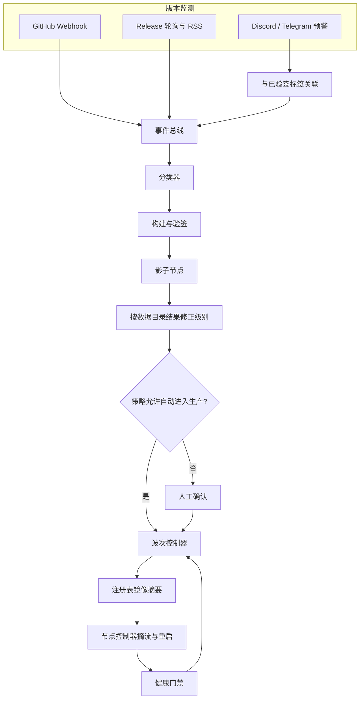
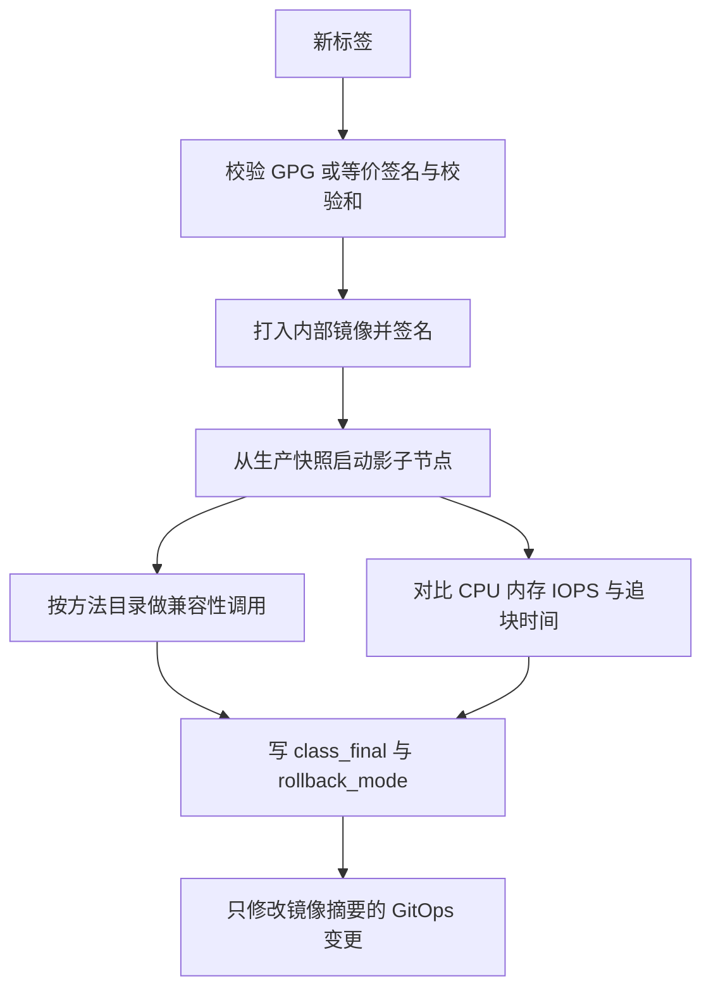
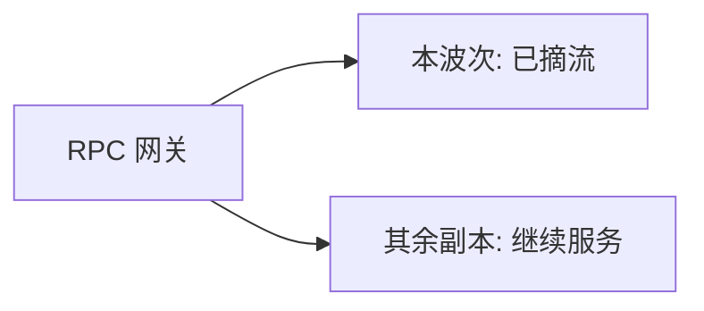

# 节点自动化监控、升级和更新

本文规定 T0 客户端（起步覆盖 BTC、ETH、SOL，同一机制扩展到 BSC 与长尾链）如何从上游发布走到生产镜像。它衔接 [交易所多链全节点运维方案](exchange-multichain-node-operations.md) 里的注册表、Ready 状态、滞后门槛和双客户端投票。

总路径是三层：

**版本监测 → CI/CD 金丝雀流水线 → 渐进升级**

监测要快，生产更换要逐波、可停、可退。期望状态只写在 Git 注册表里。流水线通过验签制品和健康门禁之后，才改镜像摘要。

## 1. 自动化边界

直接在主网节点上执行无人看管的替换脚本，会把破坏性变更、数据目录迁移和共识缺陷一次带到全部副本。本方案把「自动」放在检测、验签、构建、影子节点和逐波推进上。

| 发布类型 | 生产推进 | 人的位置 |
| --- | --- | --- |
| 安全补丁 | 影子节点与每一波健康门禁通过后自动进入下一波 | 可随时冻结；完成后 24 小时内审计 |
| 补丁 / 小版本 | 自动构建并完成影子节点，生产第一波前需一次确认 | 仪表盘确认一次，之后按门禁自动逐波 |
| 大版本（数据目录格式变化） | 自动构建。影子节点量出迁移耗时后等待审批 | 按测量结果排窗口，逐波确认或一次批准并加长烘烤 |
| 硬分叉 / 共识规则 | 自动构建并给出激活高度说明 | 绑定激活窗口，双人复核后才进入生产波次 |
| 无法分类 | 只构建，不部署 | 必须先人工分类 |

聊天频道里的「需要升级」只提高优先级。能进入流水线的输入是已验签的 Git 标签或 Release 制品摘要。

同一条链上两种执行客户端（如 Reth 与 Nethermind）各有独立升级活动。默认互斥：一种客户端还在波次中时，另一种停在影子节点阶段。规范哈希因此始终有一种仍在已知版本上的客户端可对照。

## 2. 架构



| 组件 | 职责 |
| --- | --- |
| 版本监测器 | 接收 Webhook、轮询 Release、消费公告频道，去重后发出 `version.detected` |
| 分类器 | 给出初始级别；影子节点结束后给出最终级别和回滚方式 |
| 构建器 | 验签上游制品，打内部镜像，写 SBOM，用内部密钥签名 |
| 影子节点 | 用生产快照拉起新版本，不进网关，跑兼容性与资源对比 |
| 波次控制器 | 按角色和地域改注册表摘要，调用摘流，检查门禁，失败则停止并回滚 |
| 通知器 | 把检测、门禁、待审批和停机发到 Slack / 钉钉 / 飞书 |
| 节点控制器 | 已有组件。只收敛注册表，不自己发现上游版本 |

事件总线可以用 Kafka 或同等持久队列。队列只负责触发。当前该跑哪个摘要，以注册表为准。

## 3. 版本监测

上游渠道不同，监测器按源配置组合使用。源清单放在 `upgrades/sources/*.yaml`，和链注册表一起评审。

```yaml
id: bitcoin-core
chain_ids: [btc-mainnet]
kind: github_release
repo: bitcoin/bitcoin
track_series: "28"          # 只自动跟随当前系列；更高系列记为待规划
asset_pattern: "bitcoin-*-x86_64-linux-gnu.tar.gz"
checksum_asset: SHA256SUMS
signature_asset: SHA256SUMS.asc
gpg_keyring: keys/bitcoin-core.asc
poll_interval: 20m
webhook: true
announcement_channels:
  - kind: rss
    url: https://github.com/bitcoin/bitcoin/releases.atom
```

起步源：

| 客户端 | 仓库 |
| --- | --- |
| Bitcoin Core | `bitcoin/bitcoin` |
| Geth | `ethereum/go-ethereum` |
| Reth | `paradigmxyz/reth` |
| Besu | `hyperledger/besu` |
| Nethermind | `NethermindEth/nethermind` |
| Agave | `anza-xyz/agave` |
| Lighthouse / Prysm 等共识客户端 | 各自仓库，活动与执行客户端分开 |

ETH 的执行层和共识层平时分开升级。级别被定为硬分叉时，注册表里的 `coupled_sources` 把两侧活动绑在同一个激活窗口，避免只升一侧。

### 3.1 GitHub Release

Webhook 是低延迟入口。轮询用来补丢失的投递。

Webhook：

- 路径 `POST /v1/github/webhooks`，校验 `X-Hub-Signature-256`。
- 以 `X-GitHub-Delivery` 去重，保留 7 天。
- 只处理 Release `published`。草稿、预发布和被标记撤回的标签不进入构建。
- 校验通过后返回 202，构建异步进行。

轮询：

- 每 20 分钟拉一次 Release 列表（条件请求，遵守速率限制）。
- 使用列表而不是单独的 `/releases/latest`。`/latest` 会漏掉「当前仍在运行的旧系列上的补丁」，也可能把新的主版本当成必须立即跟随的版本。
- `track_series` 内的新标签进入分类。更高系列只发「可规划」通知，不自动替换生产摘要。
- 轮询与 Webhook 按 `(repo, tag, asset digest)` 去重。

标签解析要覆盖各客户端的实际命名，不能只认 `vMAJOR.MINOR.PATCH`。Bitcoin Core 的 `v28.x`、Agave 的版本线都按源配置里的解析器处理。解析失败时级别记为「无法分类」。

### 3.2 公告频道

Solana、Ethereum 客户端社区常在 Discord 或 Telegram 先发安全补丁和硬分叉提醒。监测器订阅注册表中的频道，匹配版本号以及 `upgrade required`、`security patch`、`hotfix`、`hard fork`。

匹配到版本号之后，监测器在已同步的 Release 里找同一标签：

- 找到且验签通过：把该活动标为高优先级，缩短轮询间隔，并呼叫值班。后续仍走第 4 节的级别策略。
- 找不到已验签标签：只呼叫值班并附上原文，不构建、不改注册表。

公告机器人使用独立的只读凭据，没有镜像仓库和 Git 写权限。

### 3.3 长尾链

T1 / T2 的镜像版本可以由 Renovate 或 Dependabot 对注册表提 PR。PR 必须经过与 T0 相同的验签、影子节点和兼容性检查。T0 以版本监测器为准。两侧同时开出变更时，按制品摘要合并为一次活动。

## 4. 级别判定

分类器先根据标签和说明给出 `class_initial`，影子节点跑完后再写 `class_final`。生产波次只看 `class_final`。

初始规则按顺序匹配，命中即停：

1. 草稿、预发布、验签失败：拒绝。
2. 说明或 GitHub Security Advisory 标明安全修复，且语义化版本停留在同一主版本：`security_patch`。
3. 说明中出现共识变更、硬分叉或激活高度：`hardfork`。
4. 主版本号变化，或源配置声明该版本线包含数据格式变更：`major`。
5. 次版本号变化：`minor`。
6. 补丁号变化：`patch`。
7. 其余：`unknown`。

影子节点可以升级级别，不会把级别降到更自动的一档：

- 新版本无法直接打开上一份快照，或日志出现数据迁移：`class_final` 至少为 `major`，`rollback_mode` 为 `snapshot`。
- 迁移耗时超过该链的 `restore_budget`：即使初始级别是补丁，也改为等待人工，并在审批单上写明实测时长。
- 数据目录可直接打开且模式版本未变：`rollback_mode` 为 `binary`。

Bitcoin Core 的主版本号不等于「立刻硬分叉」。共识是否变化以发布说明和激活高度为准，主版本号本身归入 `major` 的审批路径。

Agave 不允许一次活动跨过多个未部署的次版本。中间版本逐个走完影子节点和波次。

## 5. 金丝雀流水线



### 5.1 验签与镜像

- Bitcoin Core 比对 `SHA256SUMS` 与 `SHA256SUMS.asc`。允许的公钥指纹放在 `upgrades/keys/`，指纹变更按重大变更评审。
- 其他客户端同样使用其发布的签名或校验文件。只有标签、没有可验证制品时，活动停在「无法分类」。
- 优先把已验签的官方二进制打进内部镜像。上游提供可复现构建时，构建结果必须与官方校验和一致。
- 内部镜像用 cosign 一类机制签名。注册表只记录摘要，不记录可变标签。
- 生成 SBOM。安全补丁活动里，与本次修复无关的历史扫描告警不阻断发布；新增的、可被远程触发的严重问题会把活动改成等待人工。

构建运行器不能访问生产网关凭据和签名网络。

### 5.2 影子节点

影子节点是该链的一个额外角色：从最新已验签生产快照恢复，同步主网，不加入 RPC 池，不参与规范哈希投票，不承担广播。测试网只能辅助检查启动参数，不能代替这次主网数据目录演练。

观察窗口从滞后进入该链 SLO 之后起算：

| 最终级别 | 达标后的最短观察 | 未达标则挂起的上限 |
| --- | --- | --- |
| security_patch | 30 分钟 | 90 分钟 |
| patch | 60 分钟 | 3 小时 |
| minor | 2 小时 | 6 小时 |
| major / hardfork | 2 小时，并保留迁移耗时曲线 | 由审批人结束 |

窗口内采集 CPU、内存、磁盘 IOPS、重启次数和滞后，与同一快照上的当前生产版本基线比较。内存峰值超过基线的 1.25 倍，或追平时间超过 `restore_budget`，活动转为等待人工。

### 5.3 RPC 兼容性

测试用例从注册表的方法目录生成，对影子节点调用本链放行的方法。响应与已记录的字段类型对照。

广播类方法使用无效载荷，断言返回约定的 JSON-RPC 错误。兼容性测试不向主网提交有效交易。

`eth_syncing == false`、`getHealth`、`verificationprogress` 等健康接口按家族模板选择，门槛仍是注册表里的滞后 SLO。SOL 不用「落后不超过 1 个 slot」作为通过条件，BTC 也不把「落后 0 块」当成唯一条件。

### 5.4 GitOps 变更内容

自动合并的差异只允许两类内容：

- 本次活动对应客户端的镜像摘要
- `upgrades/campaigns/{id}.yaml` 里的活动记录

出现副本数、确认深度、放行方法或网络策略的改动时，自动合并停止，改为普通评审。

安全补丁在影子节点通过且差异符合上述范围时，由专用机器人合并。该机器人没有其他路径的写权限。

## 6. 渐进升级

网关后面始终保留达到 `min_ready_rpc` 的旧版本或已通过门禁的新版本。波次控制器每次只动一台，并先摘流再停进程。



### 6.1 波次顺序

T0 有两个地域时，先完成次地域的全部角色，烘烤通过后再动主地域。

每个地域内部：

1. 一台哨兵
2. warm 副本
3. 一台 RPC
4. 其余 RPC，每次一台
5. 广播节点，每次一台

哨兵先换，是为了在承接查询之前看到追块和数据目录问题。广播节点放在最后，充值扫描在波次期间仍可读到已知版本。若公告明确是交易传播缺陷，审批单可以把广播节点提前到 RPC 之前，并写进活动记录。

T2 只有一主一备时同样一次一台，且始终留下一台 Ready。

### 6.2 单台步骤

容器和裸金属共用同一套摘流 API。

1. `POST /v1/backends/{id}/drain`。网关停止派发新请求。进行中的查询最多等待 30 秒，广播请求最多等待 15 秒，超时返回可重试错误。WebSocket 发送关闭帧，扫描器连到其他 Ready 副本。
2. 按 `rollback_mode` 留下退路。`binary`：记录当前摘要，二进制安装到版本化目录。`snapshot`：先做文件系统一致快照并上传，再停进程。
3. 容器环境由 GitOps 更换 Pod 镜像摘要。裸金属由配置管理把 systemd 单元的二进制路径切到 `/opt/clients/{name}/{version}`，然后启动。
4. 进入 `CatchingUp`。达到下面的门禁并维持烘烤时间后，网关重新接入。
5. 本波烘烤结束，才允许下一台进入摘流。

烘烤时间：

| 最终级别 | 每台烘烤 |
| --- | --- |
| security_patch | 10 分钟 |
| patch | 30 分钟 |
| minor | 2 小时 |
| major / hardfork | 6 小时 |

### 6.3 健康门禁

一台节点重新接流，以及一波结束，都要同时满足：

- 进程在运行，烘烤期间重启次数为 0
- 同伴数不少于 `min_peers`
- 滞后不超过该链 SLO
- 客户端报告的同步状态为已完成（EVM 的 `eth_syncing` 为 false，Solana `getHealth` 为 ok，Bitcoin 的验证进度已完成且块滞后在 SLO 内）
- 在「尖端减去确认深度」的高度上，区块哈希与另一客户端或另一地域哨兵一致
- 网关侧该节点错误率低于 1%，Ready 副本数不少于 `min_ready_rpc`

比较已确认高度上的哈希，避免用仍可能重组的尖端块误停波次。

### 6.4 停机条件

出现任一情况，波次控制器不再摘除下一台，并通知值班：

- 本波门禁失败
- Ready 数量低于 `min_ready_rpc`
- 规范区块服务出现哈希不一致
- 链被标记为升级冻结
- 数据盘使用率达到 85%

安全补丁不会跳过这些条件。

## 7. 回滚

活动在影子节点阶段就写好 `rollback_mode`，生产波次不再临时选择。

| 模式 | 适用 | 动作 |
| --- | --- | --- |
| binary | 数据目录格式未变 | 摘流，切回上一摘要，用原数据目录启动 |
| snapshot | 发生过迁移或无法确认格式 | 摘流，恢复本台升级前的快照，再用上一摘要启动 |

已经烘烤通过并服务的旧波次不自动整批打回。停机时只处理尚未通过的那一台，以及控制器已经换上新摘要但未通过门禁的副本。若新版本已让规范哈希不一致，冻结该链入账，并由值班决定是否把已完成波次也按快照退回。

回滚后的节点重新经过 Ready 条件才接流。

## 8. 冻结与审批

注册表字段：

- `upgrade_freeze: true` 停止该链新的生产波次。安全补丁可以继续，只要门禁通过。
- `upgrade_freeze_all: true` 连安全补丁的生产波次也停止。监测、构建和影子节点继续，避免冻结期间丢失上游进度。

冻结用于重组处理、地域演练和事故。解除冻结本身按标准变更评审。

审批在仪表盘完成，动作写回活动记录：批准人、时间和当时的 `class_final`。待审批超过下表时间则升级告警，不自动放行。

| 最终级别 | 未批准时的提醒 |
| --- | --- |
| security_patch | 不需要生产前批准；影子节点失败立即呼叫 |
| patch / minor | 4 小时 |
| major / hardfork | 立即呼叫，并附上迁移耗时和发布说明摘要 |

## 9. 运行中的版本监控

每台节点导出：

```text
chain_client_info{chain_id, role, client, version, digest}
upstream_release_info{source, track_series, version, class}
upgrade_campaign_state{campaign_id, state, wave}
```

仪表盘每条链一列：生产摘要、上游当前系列最新版本、活动状态、已完成波次。版本不一致时着色。告警如下，告警表示「还没跟完」，控制器不会因此跳过门禁。

| 条件 | 级别 |
| --- | --- |
| 安全补丁已验签，6 小时内生产角色未全部完成 | 呼叫 |
| 补丁差异超过 24 小时 | 票 |
| 小版本差异超过 7 天 | 票 |
| 活动处于 Halted 或 RolledBack | 呼叫 |
| 影子节点超过第 5.2 节上限仍未达标 | 呼叫 |

升级进行中的面板同时看各副本滞后、Ready 数量、错误率和波次序号，便于判断该停在哪一台。

## 10. 活动记录与通知

每次活动一份记录，随 GitOps 变更提交：

```yaml
campaign_id: 2026-10-04-reth-1-2-3
source: paradigmxyz/reth
tag: v1.2.3
class_initial: patch
class_final: patch
rollback_mode: binary
upstream_digest: sha256:...
image_digest: sha256:...
signature_fingerprint: "..."
shadow:
  time_to_slo: 12m
  rss_ratio: 1.04
waves:
  - id: region-a-sentinel-1
    result: passed
    started_at: 2026-10-04T01:00:00Z
    finished_at: 2026-10-04T01:35:00Z
approvers: []
result: completed
```

通知发生在：检测到版本、验签失败、影子节点结束、需要确认、每一波开始和通过、停机、回滚、全部完成。内容包含链、客户端、标签、级别、发布说明摘要、活动链接和仪表盘链接。

审计记录保留 180 天，与现有 RPC 审计相同。

## 11. 注册表中的升级字段

链文件增加升级策略，阈值仍可按链覆盖：

```yaml
upgrade:
  sources: [reth, lighthouse]
  coupled_sources_on_hardfork: [reth, lighthouse]
  track_series: "1"
  freeze: false
  freeze_all: false
  shadow_replicas: 1
  wave_order: [sentinel, warm, rpc, broadcaster]
  region_order: [region-b, region-a]
  bake:
    security_patch: 10m
    patch: 30m
    minor: 2h
    major: 6h
    hardfork: 6h
```

`region-a` 为主地域时，`region_order` 把次地域放在前面。

## 12. 验收

升级系统自身上线前通过这些检查：

1. 重放一封签名错误的 GitHub Webhook，监测器拒绝且不产生镜像。
2. 公告频道出现版本号但没有对应验签 Release，活动不进入构建。
3. 预发布标签被忽略。`track_series` 之外的更高主版本只产生待规划通知。
4. 影子节点无法打开现有快照时，`class_final` 变为 `major`，`rollback_mode` 为 `snapshot`，生产摘要不变。
5. 兼容性作业使用无效广播载荷，主网上不出现测试交易。
6. 自动合并的 PR 若改动确认深度，机器人拒绝合并。
7. 演练中让金丝雀副本滞后超过 SLO，控制器停止下一台，并按 `binary` 切回原摘要。
8. Ready 数量被压到 `min_ready_rpc` 以下时，控制器不再摘流。
9. `upgrade_freeze_all` 打开时，安全补丁停在影子节点，生产摘要不变。
10. 双客户端链上，一侧波次未完成时，另一侧不能进入摘流。
11. 仪表盘上的运行版本与 `chain_client_info` 一致；人为拉大补丁差异，24 小时告警触发。

每季度选一条 T0 链做一次补丁级演练（可用内部构建的等价补丁版本），记录写进该链的 `last_upgrade_drill`。

## 13. 落地顺序

1. 版本监测器接入 Bitcoin Core、Reth、Geth、Agave 的 Webhook 和 20 分钟轮询。只通知，不改生产。退出标准：连续 14 天无漏报、无误报构建。
2. 验签、内部镜像和影子节点。退出标准：四条源各完成一次影子运行，失败签名被拒绝。
3. 波次控制器接到现有摘流 API。先在次地域哨兵上做补丁演练，门禁失败能退回。
4. 打开安全补丁的自动逐波，以及补丁 / 小版本的一次确认。大版本和硬分叉保持人工窗口。
5. 共识客户端、BSC 和第二地域纳入同一套活动记录。长尾链的 Renovate PR 复用影子节点检查。

机器规格、滞后 SLO 和 Ready 下限仍以链注册表为准。升级活动只替换其中的客户端镜像摘要。
