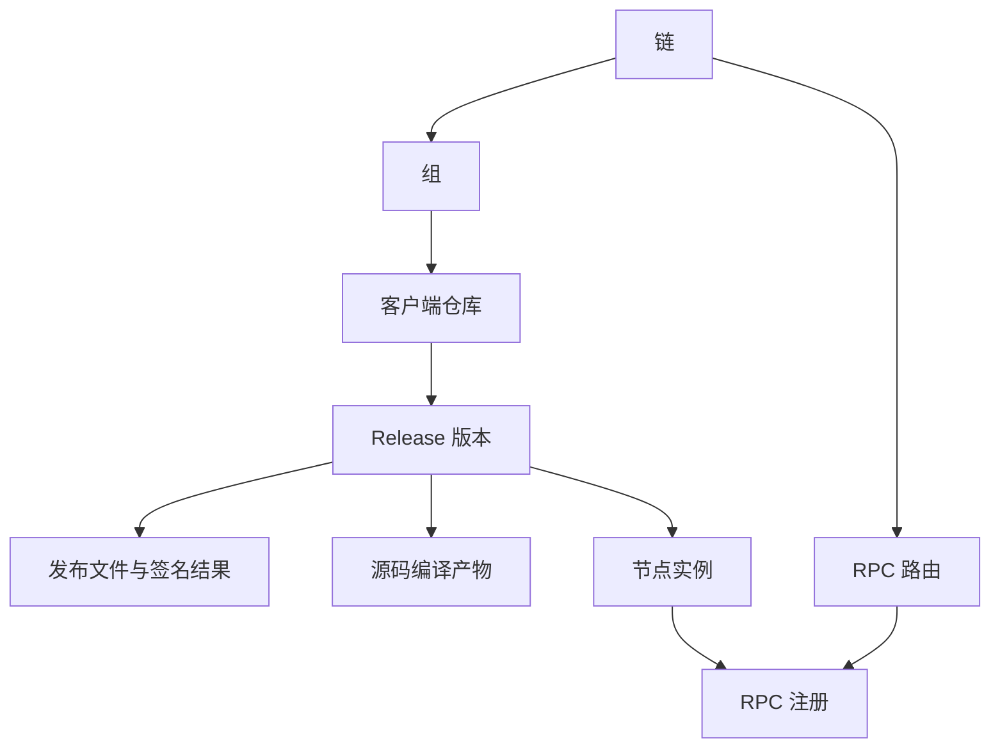
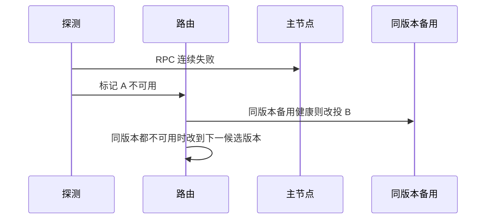
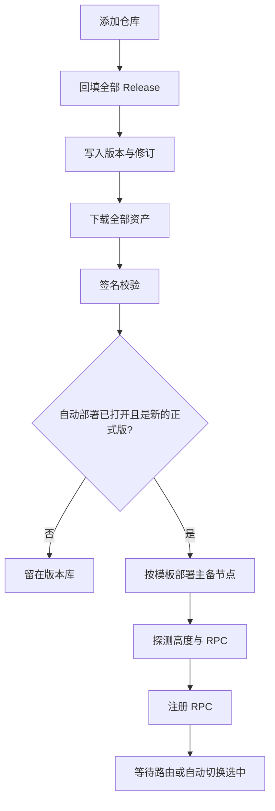
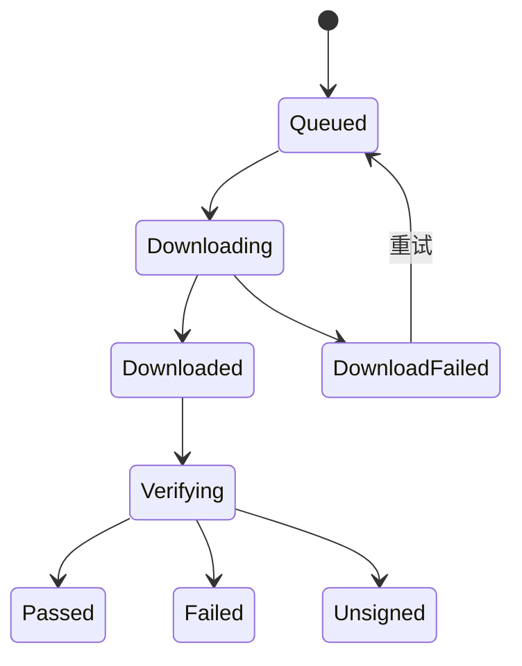
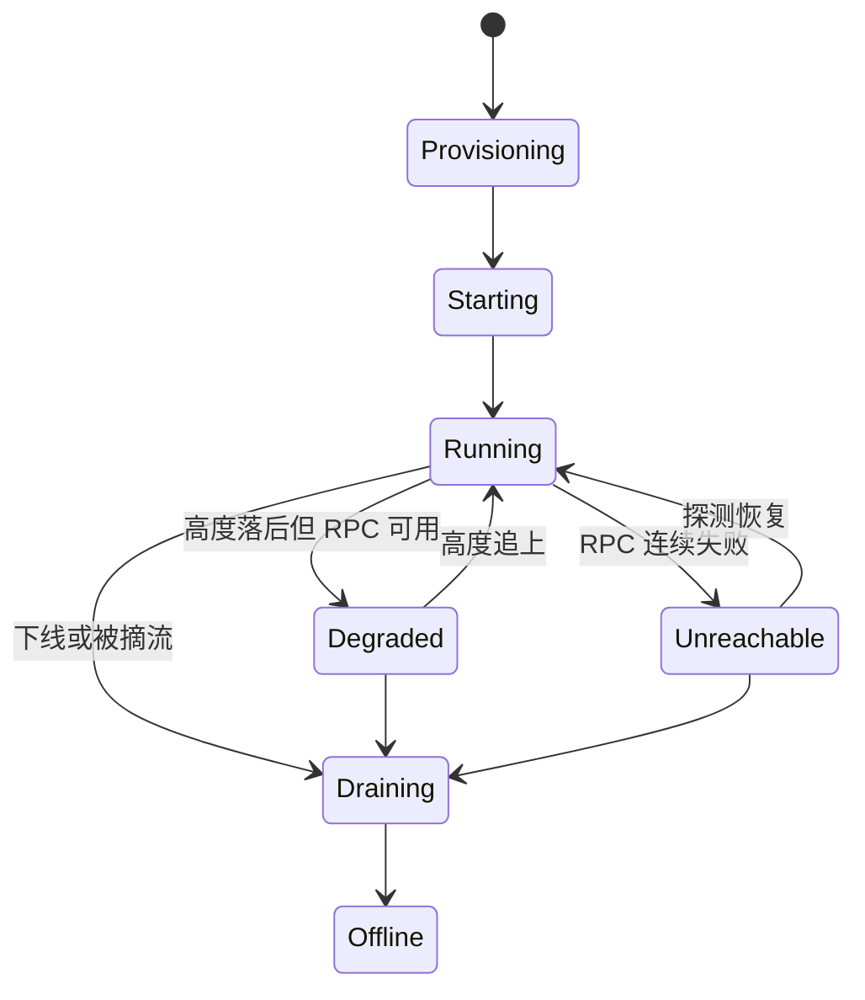

# 链节点自动监控管理系统

本文是这套系统的产品与技术设计。控制台管理「链 → 组 → 客户端仓库 → 发布版本 → 节点 → RPC 路由」。仓库一经添加就监测版本并保存历史；自动化部署、源码编译、流量切换各自有开关。节点侧的验签、滞后和摘流规则，与 [交易所多链全节点运维方案](exchange-multichain-node-operations.md)、[节点自动化监控升级和更新](节点自动化监控升级和更新.md) 一致。

## 1. 目标

运维在一个界面完成八件事：

1. 添加任意链的 GitHub 仓库，并用开关决定是否自动部署节点。
2. 每个仓库默认监测最新版本，并拉取历史上全部 Release；每次内容变化都入库。
3. 自动下载这些 Release 的全部文件，部署前完成签名校验。需要时开启源码编译，并配置编译脚本。
4. 看到已经自动部署的版本，以及每个节点是否跟上区块高度、RPC 是否可用。
5. 把相同或不同版本部署上线。同一版本可以在一个区域做主节点，在其他区域做备用。某个版本可以下线。
6. 按版本注册 RPC。页面上指定路由指向哪个版本；某个 RPC 不可用时，自动切到备用且状态可用的节点。
7. 每条链可以自定义组，组里放该链的不同客户端版本。
8. 用一块数据大盘看配置了多少条链、多少条已开启自动部署、每条链有多少运行中的节点，并动态刷新区块高度和 RPC 状态。

关闭自动部署的仓库仍然监测、入库和下载。已在线节点保持运行，直到有人在页面执行下线。

## 2. 对象模型



| 对象 | 含义 |
| --- | --- |
| 链 | 一条网络，例如 `eth-mainnet`。自带探测方式：用哪个 RPC 方法读区块高度 |
| 组 | 链内的自定义分类，例如「执行客户端」「共识客户端」「归档」 |
| 客户端仓库 | 一个 GitHub 地址。属于一条链的一个组，带自动部署开关和编译开关 |
| 版本 | 该仓库的一个 Release。历史版本全部保留 |
| 产物 | 下载的发布文件，或源码编译产出的文件。带校验和与签名结论 |
| 节点 | 某个版本在某个区域的一个运行实例，角色为主节点或备用节点 |
| RPC 服务 | 节点注册的 HTTP 或 WebSocket 地址 |
| 路由 | 这条链对外的 RPC 入口当前把流量分给哪些版本的哪些节点 |

同一客户端的同一版本可以对应多台节点。不同客户端放在同一组里，用来表达「这条链同时有 Geth 和 Reth」。

## 3. 八项能力

### 3.1 添加仓库与自动部署开关

添加时填写：链、组、GitHub 地址、显示名称。地址接受 `https://github.com/org/repo`、带 `.git` 后缀的地址和 `org/repo`。系统规范成 `org/repo`。同一链下重复地址直接打开已有仓库。

每个仓库两个独立开关：

| 开关 | 打开 | 关闭 |
| --- | --- | --- |
| 版本监测 | 添加后默认打开，不可关。仓库存在即监测 | 删除仓库时停止 |
| 自动部署 | 新的、验签通过的正式版本会按部署模板上线 | 不再创建新节点。已在线节点不动 |

自动部署只处理开关打开之后新出现的正式 Release。历史版本全部下载入库，需要哪一版由页面手工部署。这样打开开关不会把该仓库历年的版本同时拉起。

预发布和草稿入库、下载，不自动部署。

验收：

- 添加 `bitcoin/bitcoin` 后 1 分钟内出现在链详情，自动部署为关，监测为开。
- 打开自动部署后，下一个验签通过的正式版本进入部署；打开之前的历史版本保持「可手工部署」。
- 关闭自动部署后，再出现的新版本只入库，不新建节点。

### 3.2 最新版本与历史 Release 入库

添加仓库后立刻做一次全量回填，按 GitHub Release 分页拉完所有已发布版本。之后按仓库配置的间隔增量同步。上游仓库不在本组织名下时不能注册 Webhook，增量靠 GitHub App 只读令牌和 Release Atom。本组织自己的仓库可以同时用 Webhook。

每个版本保存：标签、名称、正文、是否草稿、是否预发布、目标 commit、发布时间、资产列表、原始 JSON。

版本用 `(仓库, 标签)` 唯一。正文、资产列表或发布标记发生变化时，不覆盖旧记录，而是追加一条修订：

```text
release_revision(
  release_id, revision, content_hash, body, assets_json,
  draft, prerelease, observed_at, source
)
```

`content_hash` 覆盖标签、名称、正文、草稿标记、预发布标记和资产的名称、字节数、上游摘要。同步任务本身写入 `repo_sync_run`：开始时间、结束时间、拉到的页数、新增版本数、发生修订的版本数、错误信息。

最新版本取「非草稿、非预发布、发布时间最新」的一条，单独显示在仓库页首。跟踪哪条版本线可以按仓库配置；未配置时，最新正式版就是上面这一条。

验收：

- 回填结束后，库里的版本数等于 GitHub 上该仓库已发布 Release 数。
- 上游修改了某条 Release 的正文后，下一次同步多出一条修订，旧修订仍可打开。
- 同步失败写在 `repo_sync_run`，仓库页显示最近一次成功时间和失败原因。

### 3.3 下载发布文件、校验签名、源码编译

全量回填完成后，为每条 Release 的每个资产创建下载任务，写入对象存储：

```text
release-artifacts/{repo}/{tag}/{file_name}
```

下载可断点续传。同一资产的摘要未变时不重复传输。桶用量达到配额的 80% 时暂停新下载并在大盘告警，已完成的文件保留。配额恢复后队列继续。草稿默认不下载。

签名校验在下载完成之后、任何部署之前执行。仓库选择一种校验方式：

| 方式 | 输入 |
| --- | --- |
| SHA256SUMS + 分离签名 | 校验和文件、签名文件、信任公钥 |
| cosign 或 minisign | 制品与上游签名、信任公钥 |
| 仅校验和 | 官方给出的摘要。没有签名时结论为「无签名」，不能部署 |

结论只有四种：`pending`、`passed`、`failed`、`unsigned`。`passed` 的产物才能进入部署。校验材料变更会重新校验，并追加一条校验记录，不删旧结论。

源码编译按仓库开启：

| 配置 | 说明 |
| --- | --- |
| 开关 | 关闭时不编译 |
| 触发 | 新的正式标签，或页面手工重跑某一标签 |
| 脚本 | 文本，随配置版本保存。支持引用该标签的检出目录 |
| 构建镜像 | 编译所用的容器镜像 |
| 超时 | 超时记失败 |
| 产物路径 | 容器内的输出文件，结束后拷入对象存储 |
| 环境变量 | 普通变量明文；密钥用密钥引用，页面不回显 |

编译在隔离的构建容器里执行：无生产网关凭据、无云账号密钥，网络只打开脚本声明需要的依赖源。产物计算 SHA-256，并用平台密钥签名。编译产物和官方文件是两类产物。部署时二选一，默认使用签名通过的官方文件。官方文件校验失败时，编译产物不能把那个官方文件变成可部署。

验收：

- 历史 Release 的每个资产都有下载状态和对象存储地址。
- 签名被改过的文件结论为 `failed`，部署按钮不可用。
- 打开编译并保存脚本后，下一个正式标签产出带平台签名的编译产物；脚本非 0 退出时版本页显示失败日志，节点不会使用半成品。

### 3.4 已部署版本与运行状态

每个在线节点持续探测两件事。

区块高度使用链上配置的探测模板。EVM 默认 `eth_blockNumber`，Bitcoin 系默认 `getblockcount`，Solana 默认 `getSlot`。其他链在链配置里写方法名、结果路径和高度进制。

该链「当前高度」取最近 30 秒内 RPC 可用节点的最大高度。单节点落后不超过该链配置的块数时，记为已跟上。RPC 可用性是一次真实调用：在超时内返回可解析结果即可用。连续 3 次失败记为不可用。

版本页汇总：该版本在线节点数、主/备分布、各自区域、高度、是否已跟上、RPC 可用、最近一次探测时间。

验收：

- 停掉一个节点的进程后，30 秒内该节点 RPC 变为不可用，版本页和链列表同时变化。
- 高度落后超过配置块数时，RPC 仍可能为可用，高度状态单独显示为落后。

### 3.5 多版本在线、主备与下线

部署模板挂在仓库上，决定一个版本上线时的拓扑：

```yaml
placements:
  - region: ap-east
    role: primary
    replicas: 1
  - region: eu-west
    role: standby
    replicas: 1
  - region: us-east
    role: standby
    replicas: 1
```

同一版本按模板在各区域拉起，角色为主或备。不同版本可以同时在线，例如当前路由版本和刚部署、尚未接流量的下一版。

下线作用在整个版本上：该版本全部节点先从路由摘除，再停止进程，状态改为已下线。记录保留，文件不删，可以再上线。若该版本是这条链当前唯一的路由目标，页面要求确认，并展示下线后路由将没有后端。存在其他健康版本时，确认框里可以勾选「把路由改到某健康版本」。

手工部署历史版本使用同一模板，区域和角色可以在这一次部署里改。

验收：

- 同一版本在三个区域各有一台，其中一台为主、两台为备，列表角色正确。
- 下线该版本后，这些节点不再接受路由，进程停止，审计里有操作者。
- 另一个版本的节点不受影响。

### 3.6 RPC 注册与路由

节点进入「运行中」且 RPC 探测成功后，自动注册地址、协议、版本、区域和角色。页面也可以手工登记一条 RPC，来源标记为手工。手工地址要连续探测成功，才能被选进路由。

每条链一条路由策略，页面可改：

| 字段 | 作用 |
| --- | --- |
| 模式 | 固定版本，或按权重分到多个版本 |
| 目标 | 版本及其权重 |
| 备用顺序 | 自动切换时的候选版本 |
| 失败阈值 | 连续失败次数，默认 3 次，间隔 10 秒 |
| 切回 | 原目标恢复健康并保持 60 秒后切回。默认开启 |

流量只发给当前路由选中的、RPC 可用且高度已跟上的节点。同一版本里主节点优先；主节点不可用时，用该版本其他区域的备用节点。该版本全部不可用时，按备用顺序切到下一个有健康节点的版本。切换写入路由事件：时间、原因、从哪一版到哪一版、当时各节点的探测结果。

页面上的「切到此版本」立即修改路由目标，不必等待失败。目标版本没有健康节点时，保存被拒绝。



验收：

- 页面把路由从 v1 改到 v2 后，新请求只到达 v2 的健康节点。
- 关掉 v2 全部进程后，路由在阈值时间内转到备用顺序中的健康版本，事件原因是健康检查失败。
- 未通过签名的版本不能被选为路由目标。

### 3.7 链、组与客户端版本

链详情里可以新建、重命名、排序和删除组。删除组前，组内仓库必须先移走。仓库创建时选择组，之后可以改组。

组页面是一张客户端矩阵：每一行是一个 GitHub 仓库，每一列是该仓库的一个版本，单元格显示「未部署 / 部署中 / 在线 / 已下线」以及签名结论。同一组里可以同时看到这条链的多个客户端。

链本身保存探测模板和「已跟上」允许的落后块数，组不单独改探测方法。共识客户端和执行客户端若高度含义不同，分成两条链记录，或在仓库上覆盖探测模板。

验收：

- 一条链建出「执行客户端」「共识客户端」两组，Geth 与 Reth 放在前一组，各自版本状态分开显示。
- 把 Reth 仓库改到另一组后，原组矩阵不再显示它，历史版本和节点仍在。

### 3.8 数据大盘

大盘顶部四张数，每 10 秒刷新：

| 指标 | 口径 |
| --- | --- |
| 配置链数 | `chain` 行数 |
| 已开启自动部署的链数 | 至少有一个仓库打开自动部署 |
| 运行中节点 | 状态为运行中的节点数 |
| RPC 不可用节点 | 运行中且最近探测为不可用的节点数 |

下面是链列表，行内字段实时更新：链名称、组数、自动部署开或关、运行节点数、在线版本数、当前区块高度、高度是否已跟上、RPC 汇总状态。RPC 汇总取这条链路由目标的健康情况：全部可用为正常，部分可用为部分异常，没有可用后端为不可用。

点击一行进入链详情。大盘不承担部署和改路由，避免误触。

列表通过服务端推送更新。推送中断时页面退回 10 秒轮询，并显示「数据延迟」。

验收：

- 新建一条链并添加仓库后，配置链数加一；打开该仓库自动部署后，已开启自动部署的链数加一。
- 节点高度变化后，不超过 10 秒出现在对应行。
- 路由目标全部探测失败时，该行 RPC 状态变为不可用。

## 4. 页面

| 页面 | 主要操作 |
| --- | --- |
| 大盘 | 看四个总数和链列表 |
| 链详情 | 管理组、看矩阵、进入仓库 |
| 添加仓库 | 填地址、选链和组、保存后开始回填 |
| 仓库设置 | 自动部署开关、编译开关、脚本、部署模板、签名方式、探测覆盖 |
| 版本库 | 全部历史 Release、修订记录、文件下载与签名结论、手工部署 |
| 节点 | 区域、主备、高度、RPC、日志入口 |
| 路由 | 选择版本、权重、备用顺序、查看切换事件 |
| 审计 | 开关、下线、改路由、改脚本 |

版本库里签名未通过的行不能部署。路由页用版本号而不是内部 ID 作为主文案。

## 5. 处理流程



回填和下载是队列任务，按仓库限流，避免 100 个仓库同时打满 GitHub 配额。GitHub 剩余配额低于 20% 时，拉长尚未完成回填的仓库间隔，已经在做的单页请求会重试。

节点代理只汇报状态和注册 RPC，不自行决定流量。流量以路由表为准。

## 6. 数据模型

```text
chain(id, name, slug, probe_json, lag_blocks, created_at)
chain_group(id, chain_id, name, sort_order)
repository(
  id, chain_id, group_id, github_owner, github_repo,
  auto_deploy, source_build_enabled, build_config_json,
  deploy_template_json, signature_profile_json,
  probe_override_json, created_at
)
release(
  id, repository_id, tag, name, commit_sha,
  published_at, draft, prerelease, latest_revision
)
release_revision(
  id, release_id, revision, content_hash, body,
  assets_json, draft, prerelease, observed_at, source
)
repo_sync_run(
  id, repository_id, started_at, finished_at,
  pages, releases_added, revisions_added, error
)
artifact(
  id, release_id, kind,           -- official 或 source_build
  file_name, byte_size, sha256, object_key,
  download_status, signature_status, signature_detail,
  created_at
)
signature_check(
  id, artifact_id, status, verifier, detail, checked_at
)
build_job(
  id, release_id, script_revision, status,
  log_object_key, started_at, finished_at
)
node(
  id, release_id, region, role, desired_state,  -- online 或 offline
  runtime_status, rpc_url, ws_url, rpc_origin,
  created_at
)
health_sample(
  id, node_id, observed_at, height, at_tip, rpc_ok, latency_ms, error
)
rpc_route(
  id, chain_id, mode, policy_json, updated_at
)
rpc_route_target(
  id, route_id, release_id, weight, failover_rank
)
route_event(
  id, route_id, at, reason, from_release_id, to_release_id, detail_json, actor
)
audit_log(
  id, at, actor, action, object_type, object_id, before_json, after_json
)
```

`health_sample` 保留 14 天明细，更早的数据按小时聚合后删除明细。`release_revision` 和 `audit_log` 不设自动删除。

部署是否允许，由查询决定，不在版本行上写死一个可被绕过的标记：

```text
可部署 = 期望使用的产物 signature_status 为 passed
         且 download_status 为 complete
         且节点模板里的区域可用
```

## 7. 状态

Release 文件：



节点：



`desired_state = offline` 的节点不会被自动部署任务重新拉起。再次上线是一次新的部署操作。

## 8. 自动切换规则

每次探测后重算该链的可用集合。

1. 当前路由版本里，保留 RPC 可用且高度已跟上的节点。
2. 这个集合非空时，主节点在集合内就发给主节点，否则发给同版本备用。
3. 集合为空，且连续失败达到阈值，按备用顺序找下一个版本的可用集合。
4. 找到后更新路由生效目标，并写 `route_event`，原因是 `health_failed`。
5. 原版本恢复并保持政策要求的时间后，若切回已开启，写原因 `health_recovered` 并切回。

页面手工指定的版本在下一次手工修改或又一次健康切换之前保持为期望目标。健康切换改变的是生效目标，期望目标仍显示在页面上，方便看出「期望 v2，当前因故障暂用 v1」。

同一时刻两次切换串行执行，按链加锁。

## 9. 安全

- 只有签名结论为 `passed` 的产物可以部署。无签名和校验失败都拒绝。
- 信任公钥放在签名配置里，修改公钥记入审计。
- 编译脚本在隔离容器中运行。脚本变更生成新的 `script_revision`，构建任务记录用的是哪一版。
- 下载目录不可执行。节点启动使用对象存储中已校验的对象，按摘要拉取。
- 改路由、下线、自动部署开关、编译脚本、公钥，都写 `audit_log`。
- 控制台登录后按角色限制：只读可以看大盘和状态；运维可以部署、下线和改路由；管理员可以改脚本和公钥。
- 节点机器不保存热钱包密钥。本系统不提供签名交易的功能。

## 10. 接口

控制台使用这些接口。列表接口支持按链过滤。

| 方法 | 路径 | 作用 |
| --- | --- | --- |
| GET | `/api/dashboard` | 四个总数与链列表快照 |
| GET | `/api/dashboard/stream` | 推送高度和 RPC 变化 |
| POST | `/api/chains` | 新建链 |
| POST | `/api/chains/{id}/groups` | 新建组 |
| POST | `/api/repositories` | 添加 GitHub 仓库并开始回填 |
| PATCH | `/api/repositories/{id}` | 改自动部署、编译、模板、签名、所属组 |
| GET | `/api/repositories/{id}/releases` | 历史版本，含最新修订 |
| GET | `/api/releases/{id}/revisions` | 该版本的内容变更史 |
| GET | `/api/releases/{id}/artifacts` | 文件、下载状态、签名结论 |
| POST | `/api/releases/{id}/deploy` | 手工部署。自动部署走同一内部动作 |
| POST | `/api/releases/{id}/offline` | 下线该版本全部节点 |
| POST | `/api/builds` | 按当前脚本重跑某标签 |
| GET | `/api/chains/{id}/route` | 当前期望目标与生效目标 |
| PUT | `/api/chains/{id}/route` | 页面修改路由 |
| GET | `/api/chains/{id}/route-events` | 自动切换与手工切换记录 |

节点代理：

| 方法 | 路径 | 作用 |
| --- | --- | --- |
| POST | `/api/agent/nodes/{id}/health` | 上报高度与 RPC 探测结果 |
| POST | `/api/agent/nodes/{id}/rpc` | 注册或更新 RPC 地址 |

## 11. 与节点运维规格的衔接

本系统决定「部署哪一版、流量去哪」。节点如何追块、何时算滞后、滚动时如何摘流，用已有运维规格里的门槛。

对应关系：

| 控制台概念 | 运维规格 |
| --- | --- |
| 签名通过才可部署 | 上游签名校验通过后才进入镜像和启动 |
| 主节点与区域备用 | 多地域副本；备用不接流量，直到路由选中 |
| RPC 不可用后切换 | 网关摘除不健康后端 |
| 下线版本 | 先摘流，再停止 |
| 组内多个客户端 | 一条链上的不同客户端分开部署、分开统计 |

自动部署打开后，新版本先按模板成为在线节点并注册 RPC，路由仍指向原来的版本。它成为流量目标，只发生在页面切换或第 8 节的健康切换。

## 12. 实施顺序

1. 链、组、仓库、Release 回填和修订历史。验收看第 3.1、3.2 节。
2. 文件下载、签名结论、版本库页面。未通过签名的版本不能部署。
3. 手工部署、主备模板、下线、高度与 RPC 探测。
4. RPC 注册、路由页面、自动切换。
5. 大盘四个总数和动态链列表。
6. 源码编译开关、脚本版本和隔离构建。

每一步完成后再打开下一步的入口。第 1 步就可以添加仓库并看到历史版本；在第 3 步之前，自动部署开关可以保存，但执行器不会创建节点。
